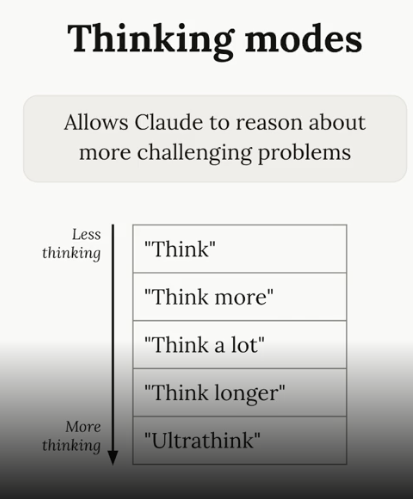

# Adding Context

Always open Claude in the project for the first time and run the command "/init".

# Adding Custom Instructions

You can customize how Claude behaves by adding instructions to your CLAUDE.md file. For example, if Claude is adding too many comments to code, you can address this by updating the file. Edit CLAUDE.md directly in your editor, or run /memory inside Claude Code to open the file. Add an instruction like Use comments sparingly. Only comment complex code.

Claude reads this file at the start of every conversation, so changes apply to your next message.

# File Mentions with '@'

When you need Claude to look at specific files, use the @ symbol followed by the file path. This automatically includes that file's contents in your request to Claude.

For example, if you want to ask about your authentication system and you know the relevant files, you can type:

How does the auth system work? @auth

Claude will show you a list of auth-related files to choose from, then include the selected file in your conversation.

# Referencing Files in CLAUDE.md

You can also mention files directly in your CLAUDE.md file using the same @ syntax. This is particularly useful for files that are relevant to many aspects of your project.

For example, if you have a database schema file that defines your data structure, you might add this to your CLAUDE.md:

The database schema is defined in the @prisma/schema.prisma file. Reference it anytime you need to understand the structure of data stored in the database.
When you mention a file this way, its contents are automatically included in every request, so Claude can answer questions about your data structure immediately without having to search for and read the schema file each time.

# Making Changes

When working with Claude in your development environment, you'll often need to make changes to existing projects. This guide covers practical techniques for implementing changes effectively, including visual communication with screenshots and leveraging Claude's advanced reasoning capabilities.

# Using Screenshots for Precise Communication

One of the most effective ways to communicate with Claude is through screenshots. When you want to modify a specific part of your interface, taking a screenshot helps Claude understand exactly what you're referring to.

To paste a screenshot into Claude, use Ctrl+V (not Cmd+V on macOS). This keyboard shortcut is specifically designed for pasting screenshots into the chat interface. Once you've pasted the image, you can ask Claude to make specific changes to that area of your application.

# Planning Mode

For more complex tasks that require extensive research across your codebase, you can enable Planning Mode. This feature makes Claude do thorough exploration of your project before implementing changes.

Enable Planning Mode by typing /plan or by pressing Shift + Tab twice (or once if you're already auto-accepting edits). In this mode, Claude will:

- Read more files in your project
- Create a detailed implementation plan
- Show you exactly what it intends to do
- Wait for your approval before proceeding

This gives you the opportunity to review the plan and redirect Claude if it missed something important or didn't consider a particular scenario.

Tip: when reviewing the plan, you can press Ctrl+G to open it in your text editor. You can precise edits before approving the plan, and Claude will see the final version you submit.

# Effort level: how hard Claude thinks

By default, Claude reasons through problems before answering. You'll see hints like "still thinking" while it works. If you want to see Claude's reasoning process, press Ctrl+O to expand the actual reasoning steps.

You can control is how Claude reasons through a problem by setting an effort level. Run /effort to see your current level and adjust it: low is faster and cheaper, max reasons longest on hard problems. The default depends on your model and plan — /effort shows you what yours is.

If you want to signal to Claude that it should do extra thinking on a single prompt, use the keyword ultrathink in your prompt. This signals to Claude that it should reason more on this turn, but doesn't adjust the session's effort level.

# When to Use Planning vs Effort

These two features handle different types of complexity:

Planning Mode is best for:

- Tasks requiring broad understanding of your codebase
- Multi-step implementations
- Changes that affect multiple files or components

Adjusting to a higher effort level is best for:

- Complex logic problems
- Debugging difficult issues
- Algorithmic challenges

You can combine both modes for tasks that require both breadth and depth. Just keep in mind that both features consume additional tokens, so there's a cost consideration for using them.

# Thinking Modes



# Controlling context

When working with Claude on complex tasks, you'll often need to guide the conversation to keep it focused and productive. There are several techniques you can use to control the flow of your conversation and help Claude stay on track.

# Interrupting Claude with Escape

Sometimes Claude starts heading in the wrong direction or tries to tackle too much at once. You can press the Escape key to stop Claude mid-response, allowing you to redirect the conversation.

This is particularly useful when you want Claude to focus on one specific task instead of trying to handle multiple things simultaneously. For example, if you ask Claude to write tests for multiple functions and it starts creating a comprehensive plan for all of them, you can interrupt and ask it to focus on just one function at a time.

# Combining Escape with Memories

One of the most powerful applications of the escape technique is fixing repetitive errors. When Claude makes the same mistake repeatedly across different conversations, you can:

- Press Escape to stop the current response
- Run /memory (or edit CLAUDE.md directly) to add a note about the correct approach
- Continue the conversation with the corrected information

  This prevents Claude from making the same error in future conversations on your project.

# Rewinding Conversations

During long conversations, you might accumulate context that becomes irrelevant or distracting. For instance, if Claude encounters an error and spends time debugging it, that back-and-forth discussion might not be useful for the next task.

You can rewind the conversation by pressing Escape twice or typing /rewind. This shows you all the messages you've sent, allowing you to jump back to an earlier point and continue from there. This technique helps you:

- Maintain valuable context (like Claude's understanding of your codebase)
- Remove distracting or irrelevant conversation history
- Keep Claude focused on the current task

# Context Management Commands

Claude provides several commands to help manage conversation context effectively:

/compact
The /compact command summarizes your entire conversation history while preserving the key information Claude has learned. This is ideal when:

- Claude has gained valuable knowledge about your project
- You want to continue with related tasks
- The conversation has become long but contains important context

Use compact when Claude has learned a lot about the current task and you want to maintain that knowledge as it moves to the next related task.

/clear
The /clear command starts a new conversation with fresh context. This is most useful when:

- You're switching to a completely different, unrelated task
- The current conversation context might confuse Claude for the new task
- You want to start over without any previous context

You can still go back to the previous conversation later with /resume. The /clear command does not remove the conversation from your session history.

# When to Use These Techniques

These conversation control techniques are particularly valuable during:

- Long-running conversations where context can become cluttered
- Task transitions where previous context might be distracting
- Situations where Claude repeatedly makes the same mistakes
- Complex projects where you need to maintain focus on specific components

By using escape, double-tap escape, /compact, and /clear strategically, you can keep Claude focused and productive throughout your development workflow. These aren't just convenience features—they're essential tools for maintaining effective AI-assisted development sessions.

# Custom Commands

Claude Code comes with built-in commands that you can access by typing a forward slash, but you can also create your own custom commands to automate repetitive tasks you run frequently.

# Creating Custom Commands

To create a custom command, you need to set up a specific folder structure in your project:

- Find the .claude folder in your project directory
- Create a new directory called commands inside it
- Create a new markdown file with your desired command name (like audit.md)

The filename becomes your command name - so audit.md creates the /audit command.

# Example: Audit Command

Here's a practical example of a custom command that audits project dependencies for vulnerabilities:

This audit command does three things:

- Runs npm audit to find vulnerable installed packages
- Runs npm audit fix to apply updates
- Runs tests to verify the updates didn't break anything

After creating your command file, Claude Code picks it up automatically. You don't need to restart.

# Commands with Arguments

Custom commands can accept arguments using the $ARGUMENTS placeholder. This makes them much more flexible and reusable.

For example, a write_tests.md command might contain:

```markdown
Write comprehensive tests for: $ARGUMENTS

Testing conventions:

- Use Vitest with React Testing Library
- Place test files in a **tests** directory in the same folder as the source file
- Name test files as [filename].test.ts(x)
- Use @/ prefix for imports

Coverage:

- Test happy paths
- Test edge cases
- Test error states
  You can then run this command with a file path:
```

/write_tests the use-auth.ts file in the hooks directory

The arguments don't have to be file paths - they can be any string you want to pass to give Claude context and direction for the task.

# Key Benefits

**Automation** - Turn repetitive workflows into single commands

**Consistency** - Ensure the same steps are followed every time

**Context** - Provide Claude with specific instructions and conventions for your project

**Flexibility** - Use arguments to make commands work with different inputs
Custom commands are particularly useful for project-specific workflows like running test suites, deploying code, or generating boilerplate following your team's conventions.

# MCP servers integrations with Claude Code

You can extend Claude Code's capabilities by adding MCP (Model Context Protocol) servers. These servers run either remotely or locally on your machine and provide Claude with new tools and abilities it wouldn't normally have.

One of the most popular MCP servers is Playwright, which gives Claude the ability to control a web browser. This opens up powerful possibilities for web development workflows.

## Installing the Playwright MCP Server

To add the Playwright server to Claude Code, run this command in your terminal (not inside Claude Code):

```bash
claude mcp add playwright npx @playwright/mcp@latest
```

This command does two things:

- Names the MCP server "playwright"
- Provides the command that starts the server locally on your machine

## Managing Permissions

When you first use MCP server tools, Claude will ask for permission each time. If you get tired of these permission prompts, you can pre-approve the server by editing your settings.

Open the .claude/settings.local.json file and add the server to the allow array:

```json
{
  "permissions": {
    "allow": ["mcp__playwright"],
    "deny": []
  }
}
```

Note the double underscores in mcp\_\_playwright. This allows Claude to use the Playwright tools without asking for permission every time.

## Practical Example: Improving Component Generation

Here's a real-world example of how the Playwright MCP server can improve your development workflow. Instead of manually testing and tweaking prompts, you can have Claude:

Open a browser and navigate to your application
Generate a test component
Analyze the visual styling and code quality
Update the generation prompt based on what it observes
Test the improved prompt with a new component
For instance, you might ask Claude to:

```markdown
"Navigate to localhost:3000, generate a basic component, review the styling, and update the generation prompt at @src/lib/prompts/generation.tsx to produce better components going forward."
```

Claude will use the browser tools to interact with your app, examine the generated output, and then modify your prompt file to encourage more original and creative designs.

## Results and Benefits

In practice, this approach can lead to significantly better results. Instead of generic purple-to-blue gradients and standard Tailwind patterns, Claude might update prompts to encourage:

Warm sunset gradients (orange-to-pink-to-purple)
Ocean depth themes (teal-to-emerald-to-cyan)
Asymmetric designs and overlapping elements
Creative spacing and unconventional layouts
The key advantage is that Claude can see the actual visual output, not just the code, which allows it to make much more informed decisions about styling improvements.

## Exploring Other MCP Servers

Playwright is just one example of what's possible with MCP servers. The ecosystem includes servers for:

Database interactions
API testing and monitoring
File system operations
Cloud service integrations
Development tool automation
Consider exploring MCP servers that align with your specific development needs. They can transform Claude from a code assistant into a comprehensive development partner that can interact with your entire toolchain.

# Github integration

Claude Code offers an official GitHub integration that lets Claude run inside GitHub Actions. This integration provides two main workflows: mention support for issues and pull requests, and automatic pull request reviews.

## Setting Up the Integration

To get started, run /install-github-app in Claude. This command walks you through the setup process:

- Install the Claude Code app on GitHub
- Add your API key
- Automatically generate a pull request with the workflow files

The generated pull request adds two GitHub Actions to your repository. Once merged, you'll have the workflow files in your .github/workflows directory.

## Default GitHub Actions

The integration provides two main workflows:

### Mention Action

You can mention Claude in any issue or pull request using @claude. When mentioned, Claude will:

- Analyze the request and create a task plan
- Execute the task with full access to your codebase
- Respond with results directly in the issue or PR

### Pull Request Action

Whenever you create a pull request, Claude automatically:

- Reviews the proposed changes
- Analyzes the impact of modifications
- Posts a detailed report on the pull request

## Customizing the Workflows

After merging the initial pull request, you can customize the workflow files to fit your project's needs. Here's how to enhance the mention workflow:

### Adding Project Setup

Before Claude runs, you can add steps to prepare your environment:

```workflow
- name: Project Setup
  run: |
  npm run setup
  npm run dev:daemon
```

### Custom Instructions

Provide Claude with context about your project setup:

```workflow
custom_instructions: |
The project is already set up with all dependencies installed.
The server is already running at localhost:3000. Logs from it
are being written to logs.txt. If needed, you can query the
db with the 'sqlite3' cli. If needed, use the mcp\_\_playwright
set of tools to launch a browser and interact with the app.
```

### MCP Server Configuration

You can configure MCP servers to give Claude additional capabilities:

```workflow
mcp_config: |
{
 "mcpServers": {
  "playwright": {
    "command": "npx",
    "args": [
    "@playwright/mcp@latest",
    "--allowed-origins",
    "localhost:3000;cdn.tailwindcss.com;esm.sh"
    ]
  }
 }
}
```

## Tool Permissions

When running Claude in GitHub Actions, you must explicitly list all allowed tools. This is especially important when using MCP servers.

allowed*tools: "Bash(npm:*),Bash(sqlite3:\_),mcp**playwright**browser_snapshot,mcp**playwright**browser_click,..."

Unlike local development, there's no shortcut for permissions in GitHub Actions. Each tool from each MCP server must be individually listed.

## Best Practices

When setting up Claude's GitHub integration:

- Start with the default workflows and customize gradually
- Use custom instructions to provide project-specific context
- Be explicit about tool permissions when using MCP servers
- Test your workflows with simple tasks before complex ones
- Consider your project's specific needs when configuring additional steps

The GitHub integration transforms Claude from a development assistant into an automated team member that can handle tasks, review code, and provide insights directly within your GitHub workflow.
